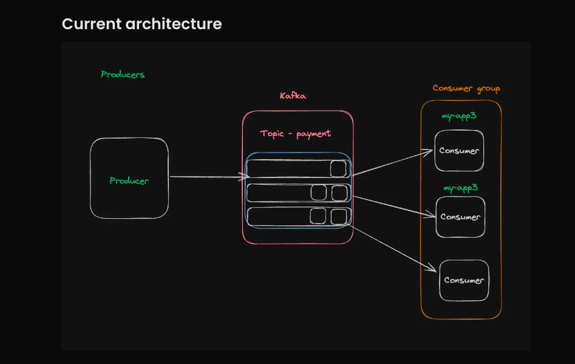

# Deep Dive into Apache Kafka

Apache Kafka is an open-source distributed event streaming platform used by thousands of companies for high-performance data pipelines, streaming analytics, data integration, and mission-critical applications.



## What is Event Streaming?
If you want to build a system where one process produces events that can be consumed by multiple consumers, Apache Kafka is an ideal solution.

## Key Jargons
- **Topics**: Think of topics as "rooms" in a Redis Pub/Sub system where messages are sent and received.
- **Partitions**: Kafka topics are split into partitions, enabling scalability and parallelism. Each partition is an ordered sequence of events.
- **Producers**: Entities or applications that write events to topics.
- **Consumers**: Entities or applications that read events from topics.
- **Consumer Groups**: A group of consumers sharing a common task, ensuring message distribution across members.

## Prerequisites
- [Docker](https://www.docker.com/) installed on your system.
- Basic understanding of terminal commands.

---

## Getting Started

### 1. **Run Kafka in Docker**
```bash
docker run -p 9092:9092 apache/kafka:3.7.1
```

### 2. **Access Kafka Container**
```bash
docker exec -it <container-id> /bin/bash
```
Replace `<container-id>` with the actual container ID. You can find it using:
```bash
docker ps
```

### 3. **Navigate to Kafka Binary Directory**
```bash
cd /opt/kafka/bin
```

---

## Working with Topics

### Create a Topic
```bash
./kafka-topics.sh --create --topic quickstart-events --bootstrap-server localhost:9092
```

### List Existing Topics
```bash
./kafka-topics.sh --list --bootstrap-server localhost:9092
```

### Consume Messages from a Topic
```bash
./kafka-console-consumer.sh --topic quickstart-events --from-beginning --bootstrap-server localhost:9092
```

### Produce Messages to a Topic
```bash
./kafka-console-producer.sh --topic quickstart-events --bootstrap-server localhost:9092
```
Type your messages in the terminal after running the command. Each line is sent as a message.

---

## Managing Kafka

### Describe a Topic
```bash
./kafka-topics.sh --describe --topic quickstart-events --bootstrap-server localhost:9092
```
This provides details like partition count, replication factor, and leader information.

### Delete a Topic
```bash
./kafka-topics.sh --delete --topic quickstart-events --bootstrap-server localhost:9092
```

### Monitor Consumer Lag
```bash
./kafka-consumer-groups.sh --bootstrap-server localhost:9092 --describe --group <group-name>
```
Replace `<group-name>` with your consumer group name.

---

## Key Observations

1. **Message Replayability**:
   - Kafka maintains a **log of messages**. Consumers can replay past messages even if they start late.
   - Kafka provides **at-least-once delivery guarantees**, ensuring messages are delivered even if retries are required.

2. **Consumer-Partition Mapping**:
   - If the **number of partitions** is less than the **number of consumers**, some consumers will remain idle.

3. **Fault Tolerance**:
   - Kafka replicates partitions across multiple brokers, ensuring reliability in case of broker failures.

---

## Additional Tools and Resources
- [Twilio](https://www.twilio.com/en-us): Explore Kafka integrations with Twilio.
- Official Kafka Docker Image: [Apache Kafka](https://hub.docker.com/r/apache/kafka)
- [Kafka Documentation](https://kafka.apache.org/documentation/): Detailed Kafka features and configurations.

---

## Summary
Apache Kafka provides a robust, scalable, and efficient solution for event streaming. Its log-based architecture ensures reliable message delivery and replayability, making it suitable for various real-time applications. With its fault-tolerant and scalable design, Kafka is a cornerstone for modern data-driven infrastructures.

